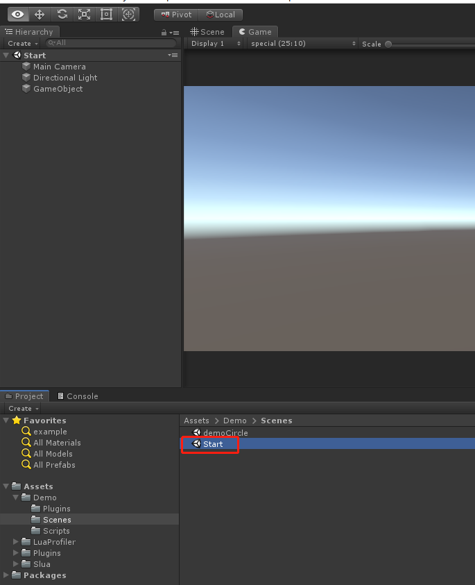
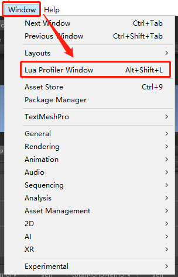
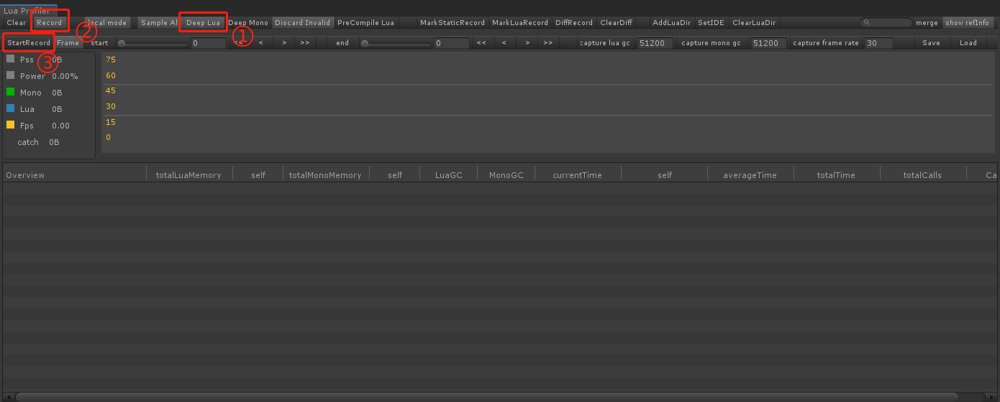
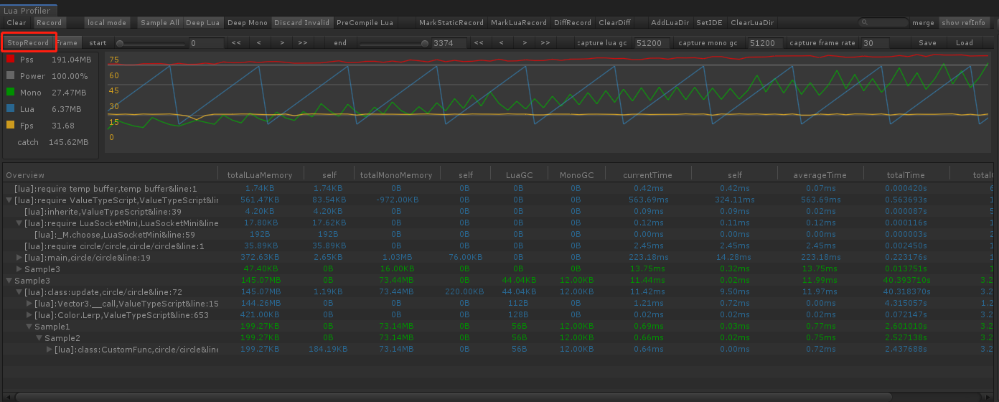
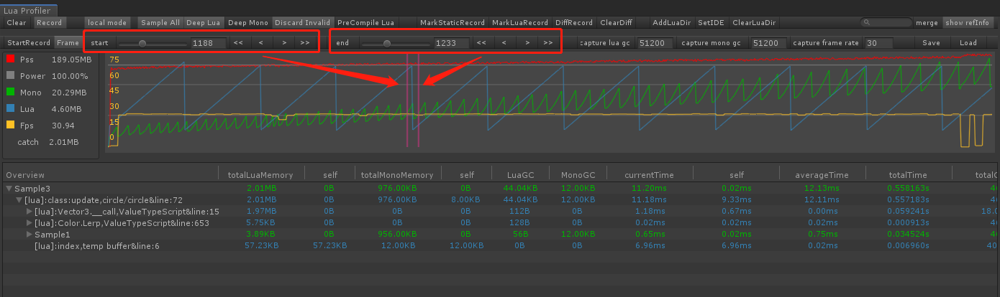

# LuaProfilerForUnity

一个适用于Unity引擎的Lua Profiler。

Lua部分使用的是[Slua](https://github.com/pangweiwei/slua)。

Profiler部分是基于[Miku-LuaProfiler](https://github.com/leinlin/Miku-LuaProfiler)的修改

### UnityPackage

[unity package](Package)

### 示例说明

1. 打开Demo场景 Assets/Demo/Scenes/Start

   

   

2. 打开LuaProfilerWindow

   

3. 依次点击`Deep Lua` -> `Record` -> `StartRecord`

   

4. 启动游戏，即可看到Profiler界面显示数据

5. 点击`StopRecord`可停止采集，通过设置start区域和end区域可以查看区间数据变化

   

   

